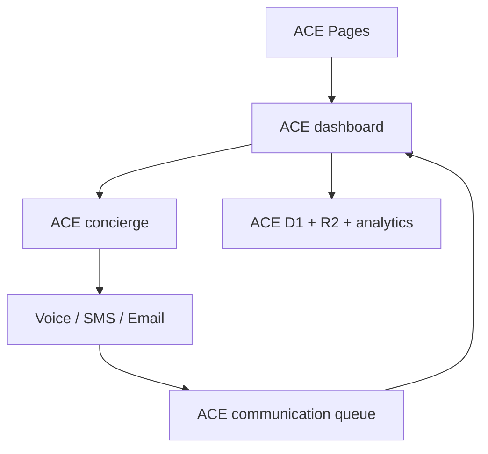

# ACE Host Cloudflare tenant deployment

## Decision

ACE Host is a dedicated logical production environment of the existing worker code, not a fork of the application and not a worker stack per franchise location.

| Layer | ACE isolation | Franchise/location model |
| --- | --- | --- |
| Dashboard | `ace-dashboard-worker` | One corporate dashboard; filter by `locationId` |
| Orchestration | `ace-concierge-worker` | Shared ACE workflows tagged by tenant/corporate/location |
| Channels | `ace-voice-worker`, `ace-sms-worker`, `ace-email-worker` | Shared ACE channel capacity; no per-location worker copies |
| Transaction data | ACE-only dashboard and event D1 databases | Rows carry `tenantId`, `corporateId`, and `locationId` |
| Async work | ACE-only follow-up and communication queues | Messages carry the same scope fields |
| Archive | `ace-call-center-archive` | Private prefixes under `tenants/ace-host/` |
| Analytics | ACE-only Analytics Engine datasets | `tenantId` is the index; corporate/location are blobs |

This keeps the existing Black Hole workers and their data untouched. It also avoids deploying five workers for every branch. A very large customer can later be promoted to another dedicated Wrangler environment without changing the data contract.

## Resource topology



Cloudflare Queues allow multiple producers but only one active consumer for a queue. The ACE communication queue therefore has its own dashboard consumer and must not reuse the Black Hole communication queue.

## 1. Create the ACE resources

Run from the repository root with an authenticated Wrangler session:

```bash
npx wrangler d1 create ace-call-center-dashboard
npx wrangler d1 create ace-call-center-events
npx wrangler r2 bucket create ace-call-center-archive

npx wrangler queues create ace-followup-jobs
npx wrangler queues create ace-followup-jobs-dlq
npx wrangler queues create ace-communication-events
npx wrangler queues create ace-communication-events-dlq
```

Copy the two D1 IDs printed by Wrangler into both affected TOML files:

| Placeholder | Replace in |
| --- | --- |
| `REPLACE_WITH_ACE_DASHBOARD_D1_ID` | `apps/dashboard/wrangler.toml` |
| `REPLACE_WITH_ACE_EVENTS_D1_ID` | `apps/dashboard/wrangler.toml`, `apps/blackhole-concierge-worker/wrangler.toml` |

Analytics Engine datasets are declared in the Wrangler environments and are created/connected during deployment.

## 2. Configure ACE secrets

Use `npx wrangler secret put NAME --env ace --config path/to/wrangler.toml`. The `INTERNAL_CALL_SECRET` value must be identical on dashboard, concierge, and voice.

| Worker | Secrets |
| --- | --- |
| Dashboard | `INTERNAL_CALL_SECRET` |
| Concierge | `INTERNAL_CALL_SECRET`, DocuSign credentials, Google Calendar credentials |
| Voice | `INTERNAL_CALL_SECRET`, `TWILIO_ACCOUNT_SID`, `TWILIO_AUTH_TOKEN`, `TWILIO_PHONE_NUMBER`, `DEEPGRAM_API_KEY`, runtime token, optional `OPENAI_API_KEY` |
| SMS | `TWILIO_ACCOUNT_SID`, `TWILIO_AUTH_TOKEN`, `TWILIO_PHONE_NUMBER` |
| Email | `RESEND_API_KEY`, `FROM_EMAIL` |

Example:

```bash
npx wrangler secret put INTERNAL_CALL_SECRET --env ace --config apps/voice-worker/wrangler.toml
```

Never place secret values in a TOML file or commit them to Git.

## 3. Deploy in dependency order

```bash
npx wrangler deploy --env ace --config apps/sms-worker/wrangler.toml
npx wrangler deploy --env ace --config apps/email-worker/wrangler.toml
npx wrangler deploy --env ace --config apps/voice-worker/wrangler.toml
npx wrangler deploy --env ace --config apps/blackhole-concierge-worker/wrangler.toml
npx wrangler deploy --env ace --config apps/dashboard/wrangler.toml

npm --prefix apps/frontend run build
npx wrangler pages deploy apps/frontend/dist --project-name ace-call-center --config apps/frontend/wrangler.toml
```

The ACE voice environment uses the authenticated public concierge URL rather than a service binding. This removes the voice/concierge circular deployment dependency. Concierge-to-voice and dashboard-to-concierge remain private service bindings.

## 4. Configure provider callbacks

- Twilio voice status and stream URLs: the `ace-voice-worker` URLs from its TOML.
- Twilio SMS status URL: the `ace-sms-worker` URL from its TOML.
- DocuSign return/connect URLs: the `ace-concierge-worker` URL.
- Lead form API: the ACE Pages site `/api/leads` endpoint.

## 5. Validate the tenant boundary

```bash
curl https://ace-dashboard-worker.cryptocapitalgroupfl.workers.dev/api/health
curl https://ace-concierge-worker.cryptocapitalgroupfl.workers.dev/api/health
curl https://ace-voice-worker.cryptocapitalgroupfl.workers.dev/health
curl https://ace-sms-worker.cryptocapitalgroupfl.workers.dev/api/health
curl https://ace-email-worker.cryptocapitalgroupfl.workers.dev/api/health
```

Health output should report `tenantId: ace-host`. Dashboard API responses also return `X-Tenant-Id`, `X-Corporate-Id`, and `X-Location-Id` headers.

Confirm that:

1. An ACE lead appears only in the ACE D1 databases.
2. Communication events reach `ace-communication-events`, not `blackhole-communication-events`.
3. Analytics writes land in the `ace_*` datasets.
4. Event archives appear under `tenants/ace-host/events/` and signed PDFs under `tenants/ace-host/documents/`.
5. Existing Black Hole health checks and queue depth remain unchanged.

## Adding franchises

Do not copy Wrangler environments for ordinary ACE franchises. Create each location in the ACE tenant data with a stable ID such as `tampa-dc-01`; send that ID as `X-Location-Id` or `locationId`. Corporate users query all locations, while branch users are restricted to their permitted IDs at the application authorization layer.

Create a new Wrangler environment only when a corporate tenant requires one or more of:

- contractual data isolation;
- dedicated provider credentials or phone numbers;
- independent release timing;
- materially different capacity or compliance controls.

For that case, copy `[env.ace]` to `[env.<tenant-slug>]`, change every worker/resource name and URL, provision new D1/Queue/R2 resources, and keep the same tenant/corporate/location event contract.

## Intentionally excluded

The existing Black Hole video worker is not bound to ACE. Add a dedicated ACE video worker only when ACE enables that product; do not silently route ACE customer data through the Black Hole video service.
